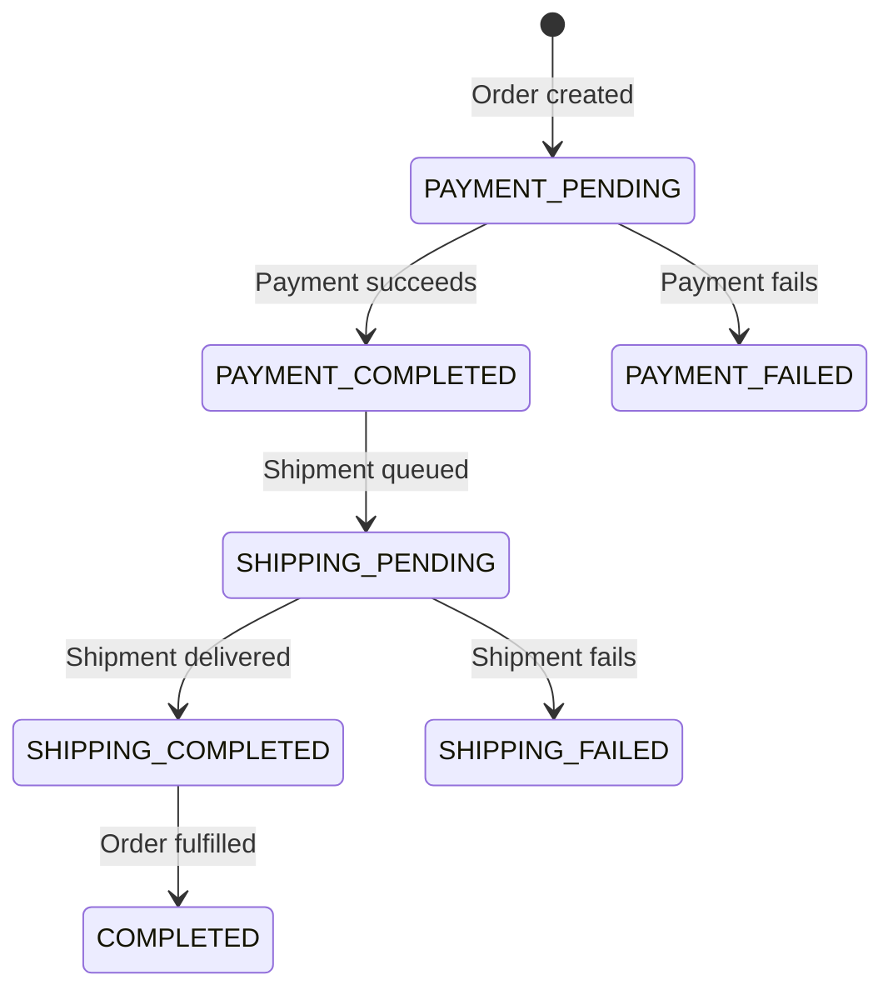

# flowMesh — Repository Overview

**flowMesh** is a TypeScript backend that models an **order → payment → shipment** workflow. It uses a **Fastify API**, **PostgreSQL (Prisma)**, and **BullMQ + Redis** for async background jobs. It is structured as a learning/demo project for event-driven order fulfillment rather than a production-ready system.

---

## What It Does (Features)

### 1. Authentication (`/auth`)

- **Register** — creates a user with bcrypt-hashed password, returns a JWT (24h expiry)
- **Login** — validates credentials and returns a JWT
- JWT is verified via a `preHandler` hook on protected routes

### 2. Orders (`/orders`) — protected

- **GET /** — list orders for the authenticated user
- **POST /** — create an order with `products[]` and `totalAmount`
  - Uses a **Prisma transaction** to create both an `Orders` record and a `Payment` record
  - Enqueues a shipment job (`order_placed`) on the BullMQ `shipmentQueue`

### 3. Shipments (`/shipments`) — protected

- **GET /:orderId** — fetch shipment(s) for a given order

### 4. Background Workers (BullMQ)

- **Shipment worker** — simulates a full shipment lifecycle:
  - `order_placed` → create shipment (`PENDING`)
  - `order_shipped` → update to `SHIPPED` (after 60s delay)
  - `order_delivered` → update to `DELIVERED` (after 120s delay)
- **Payment worker** — scaffolded but **not implemented** (empty handler)

### 5. Data Model (PostgreSQL via Prisma)

| Model     | Purpose                                      |
|-----------|----------------------------------------------|
| `Users`   | Auth (username/password)                     |
| `Orders`  | Product list, total, status, linked to user   |
| `Payment` | One-to-one with order, status enum           |
| `Shipment`| One-to-one with order, products, status enum |

Order status enum covers the full lifecycle (`PAYMENT_PENDING` → `COMPLETED`), but most transitions are **not wired up in code yet**.

---

## Project Structure

```
flowMesh/
├── lib/
│   └── prismaClient.ts          # Prisma + pg adapter singleton
├── prisma/
│   ├── schema.prisma            # DB models & enums
│   └── migrations/              # 6 migrations (users → orders → payment → shipment)
├── src/
│   ├── api.ts                   # API entry (HTTP server only)
│   ├── server.ts                # Fastify entry point (port 5555)
│   ├── api/
│   │   ├── DockerFile           # API multi-stage image
│   │   ├── routes/              # authRouter, ordersRouter, shipmentRouter, healthRouter
│   │   ├── controllers/         # order, shipment (payment controller is empty)
│   │   ├── middlewares/         # JWT auth hook
│   │   └── services/            # createOrder, createPayment
│   ├── queue/                   # paymentQueue, shipmentQueue (BullMQ)
│   ├── workers/                 # paymentWorker (stub), shipmentWorker (working)
│   │   └── DockerFile           # Worker multi-stage image
│   ├── schema/                  # Fastify JSON Schema validation
│   ├── types/                   # Fastify request augmentation (userId)
│   └── generated/prisma/        # Prisma client output (gitignored)
├── docker-compose.yml           # Full stack (Postgres, Redis, API, workers, logging)
├── deploy.sh                    # Docker Compose deploy helper
├── plan.md                      # Intended architecture (not fully built)
├── prisma.config.ts
├── tsconfig.json
└── package.json
```

### Tech Stack

- **Runtime:** Node.js + TypeScript (`tsx` for dev)
- **HTTP:** Fastify 5 + Pino logging
- **DB:** PostgreSQL + Prisma 7 (driver adapter pattern)
- **Queue:** BullMQ + Redis
- **Auth:** bcryptjs + jsonwebtoken

### NPM Scripts

| Script                    | Purpose                    |
|---------------------------|----------------------------|
| `npm run dev`             | Start API server           |
| `npm run worker:shipment` | Start shipment worker      |
| `npm run worker:payment`  | Start payment worker (no-op today) |

### Intended vs. Actual Architecture

`plan.md` describes a more mature layout (`modules/`, repositories, producers, error middleware, idempotency utils, Stripe integration). The **current codebase is simpler** — mostly `api/` + `queue/` + `workers/` without the domain-module layer.

---

## API Endpoints

| Method | Path                  | Auth | Description              |
|--------|-----------------------|------|--------------------------|
| POST   | `/auth/register`      | No   | Register user, get JWT   |
| POST   | `/auth/login`         | No   | Login, get JWT           |
| GET    | `/orders`             | Yes  | List user's orders       |
| POST   | `/orders`             | Yes  | Create order + payment   |
| GET    | `/shipments/:orderId` | Yes  | Get shipment for order   |

---

## Order Lifecycle (Designed)



> **Note:** Only the shipment sub-status transitions (`PENDING` → `SHIPPED` → `DELIVERED`) are implemented today. Order-level status updates are not yet wired up.

---

## Weaknesses & Suggested Improvements

### Critical / Functional Gaps

1. **Payment flow is incomplete** — `paymentWorker.ts` is empty, `paymentQueue` is never used, and order/payment statuses are never updated after creation. The payment side of the workflow is mostly schema-only.
2. **Order status is stale** — enums like `PAYMENT_COMPLETED`, `SHIPPING_PENDING`, `COMPLETED` exist but are never set; only shipment sub-statuses change.
3. **No ownership check on shipments** — `GET /shipments/:orderId` does not verify the order belongs to the requesting user (potential data leak).
4. **Payment model missing amount** — `createPayment` accepts `amount` but the `Payment` table has no amount field.

### Security

5. **JWT secret logged on register** — `fastify.log.info` logs `SECRET_JWT` during registration.
6. **Auth header handling** — middleware expects a raw token, not `Bearer <token>`; login returns wrong-password as a 200 body instead of 401.
7. **Weak validation** — no password strength, username format, or product/amount constraints beyond type checks.
8. **Error responses leak internals** — registration/login can return raw `err` objects to clients.

### Architecture & Code Quality

9. **No centralized error handling** — planned `error.middleware.ts` doesn't exist; each controller handles errors ad hoc.
10. **Inconsistent logging** — mix of `console.log`, `console.error`, and Fastify/Pino logger.
11. **Empty/stub files** — `payment.controller.ts` is empty; payment worker is a placeholder.
12. **Repository/service layer incomplete** — business logic lives in controllers; `plan.md` domain modules were never built.
13. **Shipment worker self-enqueues** — works, but BullMQ **Flows** or a dedicated scheduler would be cleaner for chained delayed jobs.

### DevOps & DX

14. **No README** — addressed in repo root (`README.md`, `INSTRUCTIONS.md`).
15. **No tests** — `npm test` is a stub; no unit or integration tests.
16. **Docker Compose** — full stack via `docker-compose.yml` + `deploy.sh` (build, migrate, restart, logs).
17. **Health/readiness endpoints** — `GET /health` (liveness) and `GET /ready` (DB + Redis); Compose healthcheck uses `/ready`.
18. **No graceful worker shutdown** — workers lack SIGTERM handling (API entry in `src/api.ts` handles shutdown for HTTP only).

### Suggested Priority Improvements

| Priority | Improvement |
|----------|-------------|
| High     | Finish payment worker + enqueue payment jobs; sync `Orders.status` with payment/shipment events |
| High     | Add order ownership checks on shipment routes |
| High     | Remove secret logging; fix auth error status codes |
| Medium   | Centralized error middleware + consistent Pino logging |
| Medium   | Add tests for auth, order creation, and worker job handling |
| Low      | Align codebase with `plan.md` (domain modules, repositories) or update the plan to match reality |
| Low      | Wire up `prom-client` metrics; add Bull Board for queue visibility |

---

## Bottom Line

flowMesh is a solid skeleton for an **async order-fulfillment pipeline** — auth, transactional order creation, and a working shipment worker chain are in place. The main gap is that **payment processing and order state transitions are unfinished**, and production concerns (security hardening, tests) are still largely absent. Docker Compose, multi-stage images, health endpoints, and `deploy.sh` cover basic deployment and monitoring; it still reads as an early-stage prototype with a clear direction in `plan.md` that needs to be implemented.
