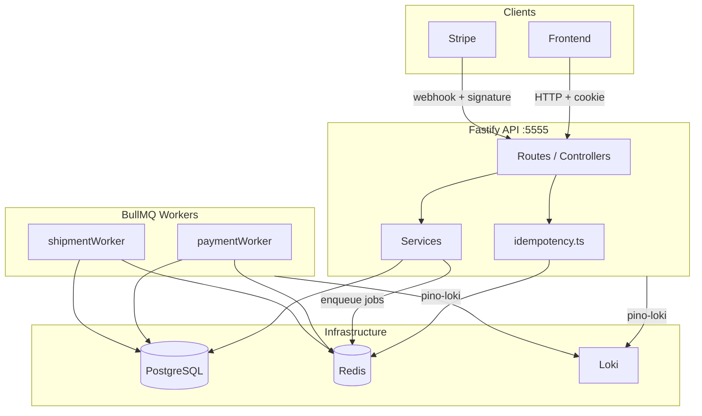
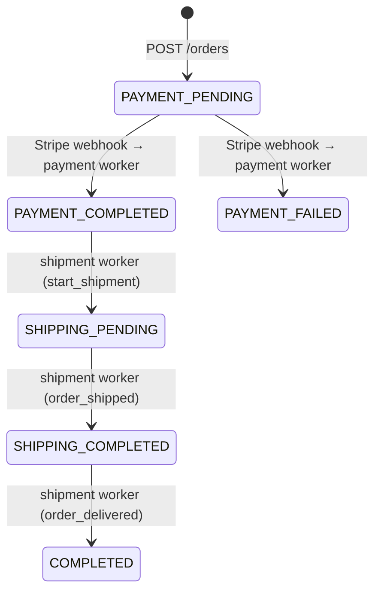
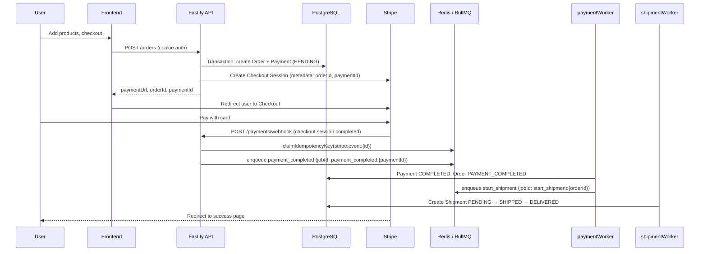
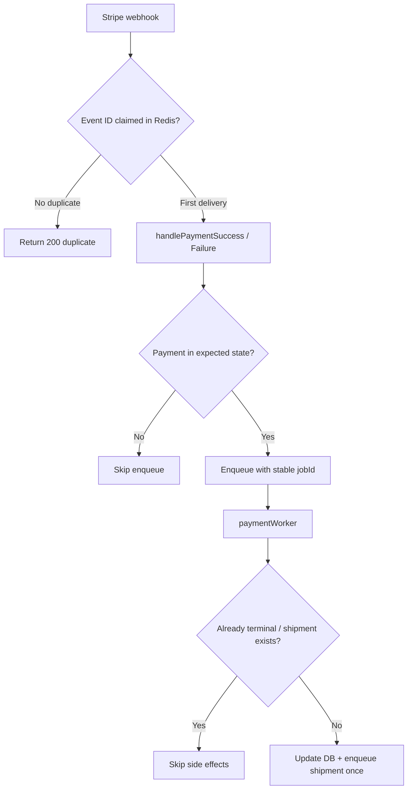
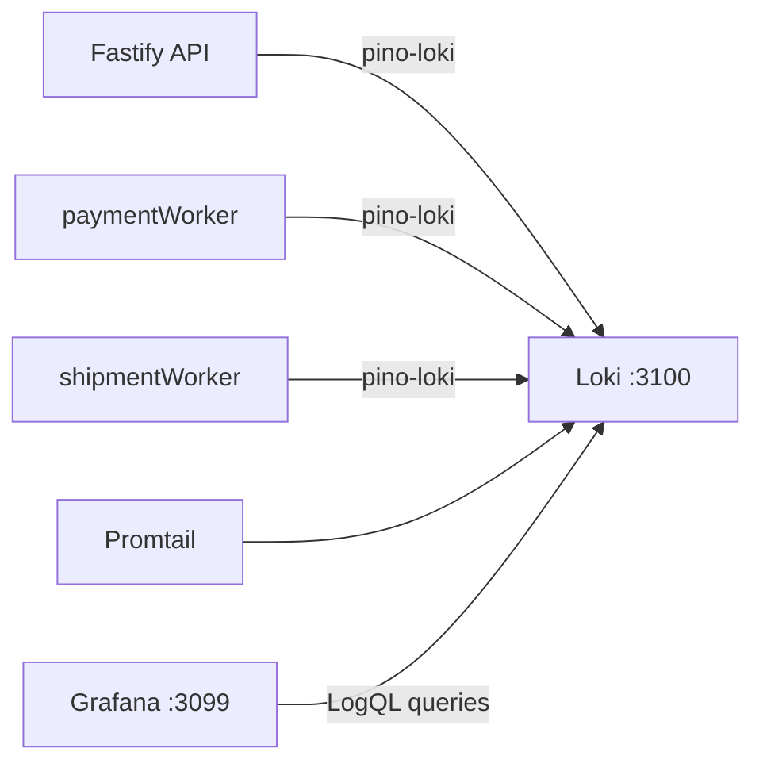
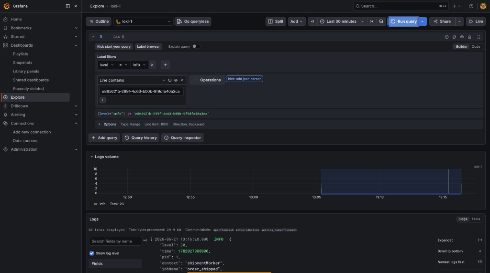
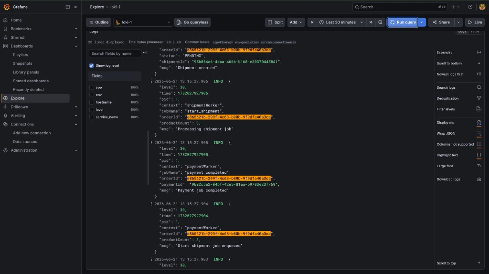
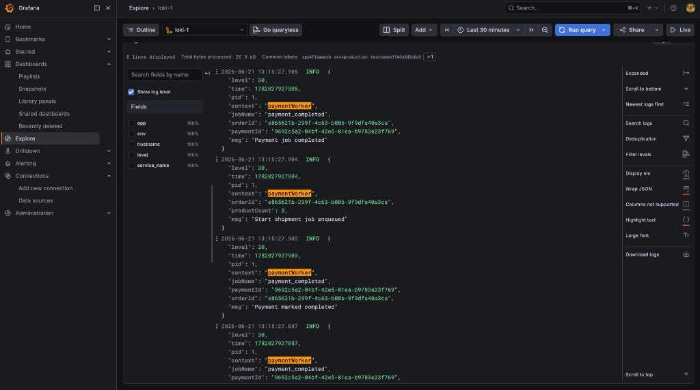
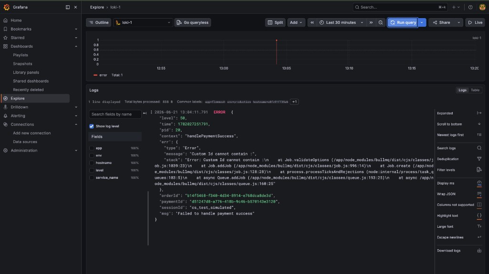

# flowMesh Backend

**flowMesh** is a TypeScript backend that models an **order → payment → shipment** workflow. It uses a Fastify API, PostgreSQL (Prisma), Stripe Checkout, and BullMQ + Redis for async background processing.

The project is structured as a learning/demo codebase for **event-driven order fulfillment**: HTTP handlers stay fast by enqueueing work, workers apply state transitions, and Stripe webhooks drive the payment side of the pipeline.

---

## Table of Contents

- [Features](#features)
- [Tech Stack](#tech-stack)
- [Architecture Overview](#architecture-overview)
- [Order Lifecycle](#order-lifecycle)
- [Payment Flow (End-to-End)](#payment-flow-end-to-end)
- [Idempotency](#idempotency)
- [API Endpoints](#api-endpoints)
- [Data Model](#data-model)
- [Project Structure](#project-structure)
- [NPM Scripts](#npm-scripts)
- [Environment Variables](#environment-variables)
- [Getting Started](#getting-started)
- [Docker Compose & deploy.sh](#docker-compose--deploysh)
- [Deployment Models](#deployment-models)
- [Observability](#observability)
  - [Grafana & Loki in Action](#grafana--loki-in-action)
- [Security & Rate Limiting](#security--rate-limiting)
- [Known Limitations](#known-limitations)
- [Further Reading](#further-reading)

---

## Features

### Authentication (`/auth`)

- **Register** — creates a user with bcrypt-hashed password and unique email; sets an HTTP-only JWT cookie (`flowmesh_token`, 24h expiry)
- **Login** — validates credentials and sets the same JWT cookie
- Protected routes read the token from cookies (not `Authorization: Bearer`)
- Secure cookie flag is controlled by `IS_PRODUCTION`
- Stricter rate limits on auth routes (default: 10 requests / 15 minutes)
- Request body validation via Fastify JSON Schema (`authRegisterSchema`)

### Products (`/products`) — protected

- **GET /** — list all products
- **POST /** — create a product (`id`, `price`, `imageUrl`)
- Seed script populates six sample products (`prod-001` … `prod-006`)

### Orders (`/orders`) — protected

- **GET /** — list orders for the authenticated user
- **POST /** — create an order with `products[]` (product IDs; duplicates allowed for quantity)
  - Validates products exist via `calculateOrderTotal` (throws `ProductNotFoundError` if any ID is missing)
  - Computes `totalAmount` from the product catalog
  - Uses a Prisma transaction to create `Orders` + `Payment` records atomically
  - Calls `initiatePayment` → Stripe Checkout Session via the payment provider adapter
  - Returns `orderId`, `paymentId`, `paymentUrl`, `sessionId`

### Payments (`/payments`)

- **POST /webhook** — Stripe webhook endpoint (no JWT; verified via Stripe signing secret)
  - Raw request body preserved for signature verification (`request.rawBody`)
  - **Idempotent** — duplicate Stripe events are deduplicated by `event.id` (see [Idempotency](#idempotency))
  - Handles:
    - `checkout.session.completed` → enqueue `payment_completed`
    - `checkout.session.expired` → enqueue `payment_failed`
    - `payment_intent.payment_failed` → enqueue `payment_failed`
  - Exempt from global rate limiting
- **GET /:orderId** — fetch payment records for given order IDs (query: `orderId`; currently unauthenticated)

### Shipments (`/shipments`) — protected

- **GET /:orderId** — fetch shipment(s) for a given order

### Background Workers (BullMQ + Redis)

| Worker | Queue | Jobs |
|--------|-------|------|
| Payment worker | `paymentQueue` | `payment_completed`, `payment_failed` |
| Shipment worker | `shipmentQueue` | `start_shipment`, `order_shipped`, `order_delivered` |

**Payment worker** — on `payment_completed`:
- Skips if payment is already `COMPLETED` (idempotent)
- Updates `Payment` → `COMPLETED` and `Orders` → `PAYMENT_COMPLETED` in a transaction
- Enqueues `start_shipment` with a stable BullMQ `jobId` (skips if shipment already exists)

**Payment worker** — on `payment_failed`:
- Skips if payment is already `FAILED` or `COMPLETED`
- Updates `Payment` → `FAILED` and `Orders` → `PAYMENT_FAILED`

**Shipment worker** — simulates fulfillment with delayed jobs:
- `start_shipment` → creates shipment (`PENDING`), order → `SHIPPING_PENDING`; schedules `order_shipped` after **60s**
- `order_shipped` → shipment → `SHIPPED`, order → `SHIPPING_COMPLETED`; schedules `order_delivered` after **120s**
- `order_delivered` → shipment → `DELIVERED`, order → `COMPLETED`

All queue jobs use **3 retries** with **exponential backoff** (1s base delay). Jobs are persisted in Redis — workers do not need to be running when a job is enqueued; they pick up waiting jobs on startup.

### Docker & Production Build

- **Docker Compose** spins up the full stack: PostgreSQL, Redis, API, both workers, and the logging stack (Loki, Promtail, Grafana)
- Separate **multi-stage Dockerfiles** for the API (`src/api/DockerFile`) and workers (`src/workers/DockerFile`)
  - `deps` → install dependencies (cached on lockfile changes)
  - `build` → `prisma generate` + `yarn build` (TypeScript → `dist/`)
  - `prod-deps` → production-only `node_modules`
  - `runner` → minimal runtime image (`dist/`, prod deps, `prisma/` for migrations); runs as non-root `flowmesh` user
- **`.env.docker`** overrides hostnames for in-network service discovery (`postgres`, `redis`, `loki`)
- **`deploy.sh`** wraps common Compose workflows: rebuild, migrate, seed, recreate, restart, logs
- API **healthcheck** in Compose polls `GET /ready` (DB + Redis connectivity)
- API and workers handle **graceful shutdown** on `SIGINT` / `SIGTERM`

### Health & Readiness

| Endpoint | Purpose | Response |
|----------|---------|----------|
| `GET /health` | Liveness — process is running | `200 { "status": "ok" }` |
| `GET /ready` | Readiness — PostgreSQL and Redis reachable | `200` when ready; `503` with per-dependency status when not |

Both endpoints are excluded from rate limiting. Use `/health` for simple uptime checks and `/ready` before routing traffic or after deploys.

### Observability (Grafana + Loki)

- All services ship structured JSON logs to **Loki** via `pino-loki`
- **Grafana Explore** lets you trace a single order across payment and shipment workers using `orderId` / `paymentId`
- Docker Compose includes the full logging stack out of the box (Grafana on port `3099`)
- See [Grafana & Loki in Action](#grafana--loki-in-action) for screenshots from a live deployment

---

## Tech Stack

| Layer | Technology |
|-------|------------|
| Runtime | Node.js 22 + TypeScript (ESM, `nodenext` modules) |
| HTTP | Fastify 5 |
| Validation | Fastify JSON Schema (`src/schema/`) |
| Database | PostgreSQL + Prisma 7 (`@prisma/adapter-pg` driver adapter) |
| Queue | BullMQ 5 + Redis (ioredis) |
| Payments | Stripe Checkout Sessions (Stripe SDK v22) |
| Auth | bcryptjs + jsonwebtoken + `@fastify/cookie` (HTTP-only cookies) |
| CORS | `@fastify/cors` (credentials enabled, origin = `FRONTEND_URL`) |
| Rate limiting | `@fastify/rate-limit` (Redis-backed, global + per-route overrides) |
| Idempotency | Redis `SET NX` keys (`src/utils/idempotency.ts`) |
| Logging | Pino, pino-pretty (dev), pino-loki → Grafana Loki |
| Containers | Docker, Docker Compose |
| Dev tooling | tsx (watch mode), Prisma Migrate |

**Redis usage:** BullMQ job queues, webhook idempotency keys, and API rate-limit counters share the same Redis instance. Supports `REDIS_HOST`/`REDIS_PORT` or a single `REDIS_URL` (e.g. Upstash `rediss://…`).

---

## Architecture Overview



### Layered design

| Layer | Location | Responsibility |
|-------|----------|----------------|
| Routes | `src/api/routes/` | HTTP wiring, schema, rate-limit config |
| Controllers | `src/api/controllers/` | Request/response handling, logging |
| Services | `src/api/services/` | Business logic (orders, payments, Stripe adapter) |
| Queue | `src/queue/` | BullMQ queue definitions |
| Workers | `src/workers/` | Async job processors |
| Utils | `src/utils/` | Cross-cutting helpers (idempotency) |
| Lib | `lib/` | Shared singletons (Prisma, Redis, Stripe) |

---

## Order Lifecycle



### Important: redirect ≠ webhook

Completing Stripe Checkout redirects the browser to your frontend `success` page. That redirect alone does **not** update order status. Status changes happen when:

1. Stripe sends `checkout.session.completed` to `POST /payments/webhook`
2. The webhook handler enqueues a `payment_completed` job (with idempotency guards)
3. The payment worker processes the job and enqueues `start_shipment`
4. The shipment worker processes the chained delayed jobs

In local development you must forward Stripe webhooks with the Stripe CLI (see [INSTRUCTIONS.md](./INSTRUCTIONS.md)).

---

## Payment Flow (End-to-End)



### Stripe integration details

- Checkout Sessions are created in **payment mode** with card payment method
- Line items are built from the product catalog (`price_data` with USD cents)
- Session metadata carries `orderId` and `paymentId` for webhook correlation
- Success/cancel URLs use `FRONTEND_URL` with query params for the frontend
- Webhook signature is verified with `STRIPE_WEBHOOK_SECRET` against the raw body

---

## Idempotency

Payment processing is guarded at **three layers** so duplicate Stripe deliveries or queue retries cannot double-apply side effects (mark paid twice, start shipment twice, etc.).

### Layer 1 — Webhook deduplication (Redis)

File: `src/utils/idempotency.ts`

After signature verification, each Stripe event is claimed with `SET key NX EX`:

```
idempotency:stripe:event:{event.id}
```

- **First delivery:** key is claimed → event is processed → `200` returned
- **Duplicate delivery:** key already exists → skip processing → `200 { duplicate: true }` (Stripe expects 200)
- **Handler failure:** key is released so Stripe retries can succeed

TTL defaults to **7 days** (covers Stripe's webhook retry window).

### Layer 2 — Queue job deduplication (BullMQ)

Stable `jobId`s prevent duplicate jobs in Redis:

| Job | jobId pattern |
|-----|---------------|
| Payment completed | `payment_completed:{paymentId}` |
| Payment failed | `payment_failed:{paymentId}` |
| Start shipment | `start_shipment:{orderId}` |

BullMQ will not enqueue a second job with the same `jobId` while one exists.

### Layer 3 — State checks (database)

Before applying side effects, handlers check current payment/shipment state:

| Location | Guard |
|----------|-------|
| `handlePaymentSuccess` | Skip enqueue if payment already `COMPLETED` |
| `handlePaymentFailure` | Skip enqueue if payment is not `PENDING` |
| `paymentWorker` (completed) | Skip DB update if already `COMPLETED`; skip shipment enqueue if shipment exists |
| `paymentWorker` (failed) | Skip if already `FAILED`; ignore failure if already `COMPLETED` |



---

## API Endpoints

| Method | Path | Auth | Description |
|--------|------|------|-------------|
| POST | `/auth/register` | No | Register user (`username`, `password`, `email`) |
| POST | `/auth/login` | No | Login |
| GET | `/products` | Cookie | List products |
| POST | `/products` | Cookie | Create product |
| GET | `/orders` | Cookie | List user's orders |
| POST | `/orders` | Cookie | Create order + Stripe session |
| GET | `/payments/:orderId` | No* | Get payments by order ID (query param) |
| POST | `/payments/webhook` | Stripe signature | Stripe webhook (idempotent) |
| GET | `/shipments/:orderId` | Cookie | Get shipment for order |
| GET | `/health` | No | Liveness probe |
| GET | `/ready` | No | Readiness probe (DB + Redis) |

\* Payment GET route is currently unauthenticated.

Default API port: **5555**

---

## Data Model

| Model | Fields / Notes |
|-------|----------------|
| `Users` | `id`, `username` (unique), `email` (unique), `password` (bcrypt hash) |
| `Product` | `id`, `price`, `imageUrl` — catalog used for order totals and Stripe line items |
| `Orders` | `products[]`, `totalAmount`, `userId`, `status` — one payment and one shipment per order |
| `Payment` | `orderId` (unique), `status` — one-to-one with order |
| `Shipment` | `orderId` (unique), `products[]`, `status` — one-to-one with order |

### Status enums

**OrderStatus:** `PAYMENT_PENDING` → `PAYMENT_COMPLETED` | `PAYMENT_FAILED` → `SHIPPING_PENDING` → `SHIPPING_COMPLETED` → `COMPLETED` (also `SHIPPING_FAILED` in schema, not yet wired)

**PaymentStatus:** `PENDING`, `COMPLETED`, `FAILED`

**ShipmentStatus:** `PENDING`, `SHIPPED`, `DELIVERED`

---

## Project Structure

```
flowMesh-backend/
├── lib/
│   ├── prismaClient.ts       # Prisma + pg adapter singleton
│   ├── redisClient.ts        # ioredis client (rate limit, idempotency)
│   ├── redisConnection.ts    # BullMQ connection config (supports REDIS_URL)
│   └── stripe.ts             # Stripe SDK client
├── logger/
│   └── logger.ts             # Pino logger (pretty + Loki, child loggers)
├── prisma/
│   ├── schema.prisma         # DB models & enums
│   ├── migrations/           # Prisma migrations
│   └── seed.ts               # Product catalog seed (6 products)
├── src/
│   ├── index.ts              # Combined entry: API + both workers (Render deploy)
│   ├── server.ts             # Fastify app setup (routes, CORS, rate limit)
│   ├── api/
│   │   ├── DockerFile        # API multi-stage container image
│   │   ├── routes/           # auth, orders, payments, shipments, products, health
│   │   ├── controllers/
│   │   ├── middlewares/      # JWT cookie auth (preHandler hook)
│   │   └── services/         # order, payment, Stripe adapter, webhook handlers
│   ├── queue/                # paymentQueue, shipmentQueue
│   ├── workers/
│   │   ├── DockerFile        # Worker multi-stage container image
│   │   ├── paymentWorker.ts  # payment_completed / payment_failed
│   │   └── shipmentWorker.ts # start_shipment → order_shipped → order_delivered
│   ├── utils/
│   │   └── idempotency.ts    # Redis SET NX claim/release helpers
│   ├── schema/               # Fastify JSON Schema validation
│   ├── types/                # Fastify request augmentation (userId, rawBody)
│   └── generated/prisma/     # Prisma client output (generated, gitignored)
├── docker-compose.yml        # Full local stack (DB, Redis, API, workers, logging)
├── deploy.sh                 # Docker Compose deploy helper (build, migrate, restart, …)
├── .dockerignore             # Excludes dev/docs files from image build context
├── docs/
│   └── images/grafana/       # README screenshots (Grafana Explore)
├── loki-config.yaml          # Loki configuration
├── promtail-config.yaml      # Promtail configuration
├── INSTRUCTIONS.md           # Detailed dev & prod setup guide
├── PROJECT_OVERVIEW.md       # Architecture notes & improvement backlog
├── plan.md                   # Intended future module layout
└── package.json
```

---

## NPM Scripts

| Script | Purpose |
|--------|---------|
| `yarn dev` | Start API + workers together in watch mode (`tsx watch src/index.ts`) |
| `yarn build` | Compile TypeScript to `dist/` |
| `yarn start` | Run compiled combined app (`node dist/src/index.js`) |
| `yarn worker:payment` | Start payment worker only (requires `yarn build` first) |
| `yarn worker:shipment` | Start shipment worker only (requires `yarn build` first) |
| `yarn db:seed` | Seed product catalog |
| `yarn render:build` | `prisma generate && yarn build` (Render deploy hook) |

Database migrations:

```bash
npx prisma migrate dev    # development
npx prisma migrate deploy # production
npx prisma generate       # regenerate client after schema changes
```

---

## Environment Variables

See [INSTRUCTIONS.md](./INSTRUCTIONS.md) for the full setup guide. Key variables:

| Variable | Required | Purpose |
|----------|----------|---------|
| `DATABASE_URL` | Yes | PostgreSQL connection string |
| `REDIS_HOST`, `REDIS_PORT` | Yes* | Redis for BullMQ, idempotency, rate limits |
| `REDIS_URL` | Alt* | Single URL for managed Redis (Upstash, etc.) — replaces host/port |
| `SECRET_JWT` | Yes | JWT signing secret |
| `COOKIE_SECRET` | Yes | `@fastify/cookie` signing secret |
| `STRIPE_SECRET_KEY` | Yes | Stripe API secret key |
| `STRIPE_WEBHOOK_SECRET` | Yes | Stripe webhook signing secret |
| `FRONTEND_URL` | Yes | CORS origin + Stripe redirect URLs |
| `PORT` | No | API port (default `5555`) |
| `HOST` | No | Bind address (default `0.0.0.0` in Docker) |
| `NODE_ENV` | No | `development` or `production` |
| `IS_PRODUCTION` | Yes | Secure cookie flag (`true` in prod) |
| `RATE_LIMIT_MAX` | No | Global rate limit (default `100` / minute) |
| `RATE_LIMIT_WINDOW` | No | Global rate limit window (default `1 minute`) |
| `AUTH_RATE_LIMIT_MAX` | No | Auth route limit (default `10` / 15 min) |
| `AUTH_RATE_LIMIT_WINDOW` | No | Auth rate limit window |
| `ENABLE_LOKI` | No | Set to `false` to disable Loki transport |
| `LOKI_HOST` | No | Loki push URL (default `http://localhost:3100`) |
| `LOG_LEVEL` | No | Pino log level (default `info`) |

---

## Getting Started

Full step-by-step setup (PostgreSQL, Redis, Stripe CLI, workers, production deployment) is in **[INSTRUCTIONS.md](./INSTRUCTIONS.md)**.

### Option A — Local development (manual)

```bash
yarn install
npx prisma migrate dev
yarn db:seed

# Single process: API + both workers (watch mode)
yarn dev

# Or split into separate terminals after `yarn build`:
# Terminal 2 — Payment worker:  yarn worker:payment
# Terminal 3 — Shipment worker: yarn worker:shipment

# Stripe webhook forwarding (required for payment status updates)
stripe listen --forward-to localhost:5555/payments/webhook
```

Start PostgreSQL and Redis separately (see [INSTRUCTIONS.md](./INSTRUCTIONS.md) for Docker one-liners).

### Option B — Docker Compose

Runs PostgreSQL, Redis, API, both workers, Loki, Promtail, and Grafana together.

**Prerequisites:** Docker and Docker Compose installed; a `.env` file with secrets (`SECRET_JWT`, `COOKIE_SECRET`, `STRIPE_*`, `FRONTEND_URL`, etc.). `.env.docker` is loaded automatically and overrides hostnames for in-network services.

```bash
# First time or after a code push (rebuilds app images and starts the stack)
./deploy.sh

# First deploy or schema changes
./deploy.sh --migrate

# Seed product catalog (first time)
./deploy.sh --seed

# Pull latest code, redeploy, and migrate
./deploy.sh --pull --migrate
```

Manual equivalents:

```bash
docker compose up --build -d
docker compose exec flowmesh-api npx prisma migrate deploy
docker compose exec flowmesh-api yarn db:seed
```

See [Docker Compose & deploy.sh](#docker-compose--deploysh) for all `deploy.sh` flags.

| Service | URL / Port |
|---------|------------|
| API | `http://localhost:5555` |
| API health | `http://localhost:5555/health` |
| API readiness | `http://localhost:5555/ready` |
| PostgreSQL | `localhost:5434` |
| Redis | `localhost:6379` |
| Loki | `http://localhost:3100` |
| Grafana | `http://localhost:3099` |

Stripe webhooks still need forwarding in development — run `stripe listen --forward-to localhost:5555/payments/webhook` on the host and set `STRIPE_WEBHOOK_SECRET` in `.env`, then restart the API container (`./deploy.sh --restart`).

View logs:

```bash
./deploy.sh --logs

# Or manually:
docker compose logs -f flowmesh-api
docker compose logs -f flowmesh-payment-worker flowmesh-shipment-worker
```

---

## Docker Compose & deploy.sh

`deploy.sh` is the recommended way to manage the Docker stack. It rebuilds **app services only** (`flowmesh-api`, both workers) by default and leaves infrastructure (Postgres, Redis, logging) running.

| Command | When to use |
|---------|-------------|
| `./deploy.sh` | Redeploy after pushing code (build + up) |
| `./deploy.sh --pull --migrate` | VPS/server release: pull, rebuild, migrate |
| `./deploy.sh --migrate-only` | Apply pending migrations without rebuilding |
| `./deploy.sh --recreate` | After port, env, or `docker-compose.yml` changes |
| `./deploy.sh --restart` | Quick restart without rebuild |
| `./deploy.sh --down` | Stop all containers (volumes preserved) |
| `./deploy.sh --status` | Show container status |
| `./deploy.sh --logs` | Follow app service logs |
| `./deploy.sh --help` | Full flag list |

Common combinations:

```bash
./deploy.sh --migrate --seed    # first deploy with schema + catalog
./deploy.sh --no-build --recreate   # apply compose changes without rebuild
./deploy.sh --build-only        # build images only (CI or pre-check)
```

When `--migrate` is used, the script waits for Postgres and the API `/ready` endpoint before running `prisma migrate deploy` inside the `flowmesh-api` container.

---

## Deployment Models

### Combined process (default)

`src/index.ts` starts the Fastify server **and** both BullMQ workers in one Node process. This is the default for platforms like **Render** that deploy a single web service without separate worker dynos.

Graceful shutdown closes workers first, then the HTTP server, on `SIGINT` / `SIGTERM`.

### Split workers (Docker Compose / production)

Docker Compose runs three separate containers:

| Container | Command |
|-----------|---------|
| `flowmesh-api` | `node dist/src/index.js` |
| `flowmesh-payment-worker` | `node dist/src/workers/paymentWorker.js` |
| `flowmesh-shipment-worker` | `node dist/src/workers/shipmentWorker.js` |

Use split workers when you want independent scaling and restart isolation.

---

## Observability

- Structured logging via **Pino** with per-module child loggers (`createLogger("context")`)
- Pretty console output in development (`pino-pretty`)
- **Grafana Loki** log shipping via `pino-loki` (enabled by default; set `ENABLE_LOKI=false` to disable)
- Optional **Docker logging stack**: Loki + Promtail + Grafana (port `3099`)
- Log labels include `app: flowmesh`, `env: {NODE_ENV}`, and `service_name: flowmesh`

Workers and API all emit structured JSON logs with correlation fields (`orderId`, `paymentId`, `jobName`, `context`, etc.) so a single order can be traced end-to-end in Grafana Explore.

### Logging stack



| Component | Role |
|-----------|------|
| **Pino** | Structured JSON logging in every service and worker |
| **pino-loki** | Pushes logs to Loki with labels (`app`, `env`, `service_name`) |
| **Loki** | Log aggregation and indexing (`loki-config.yaml`) |
| **Promtail** | Optional host log collection (`promtail-config.yaml`) |
| **Grafana** | Explore UI for searching, filtering, and visualizing log volume |

**Access Grafana locally (Docker Compose):** [http://localhost:3099](http://localhost:3099) → **Explore** → select the **Loki** data source.

### Useful LogQL queries

Filter by severity, then search for a specific order across all workers:

```logql
{app="flowmesh"} |= "e865621b-299f-4c63-b00b-9f9dfa40a3ca"
```

Narrow to payment worker activity only:

```logql
{app="flowmesh"} | json | context="paymentWorker"
```

Surface errors with full stack traces:

```logql
{app="flowmesh"} | json | level="ERROR"
```

Each log line carries structured fields — `context` (module name), `jobName`, `orderId`, `paymentId`, `sessionId`, `msg` — so you can pivot from a Stripe webhook failure to the exact worker job that followed.

### Grafana & Loki in Action

The screenshots below are from **Grafana Explore** querying production logs shipped by `pino-loki`. They show how flowMesh traces a real order through payment and shipment workers using correlation IDs.

#### Trace an order by ID

Search for a single `orderId` to see every log line emitted across the pipeline — payment worker, shipment worker, and API — in one timeline view. A logs volume graph above the stream shows activity spikes over the selected time range.



#### Full order lifecycle in logs

Following one order from payment completion through shipment creation. Structured fields make the handoff between workers explicit:

| Timestamp | Context | Event |
|-----------|---------|-------|
| — | `paymentWorker` | `payment_completed` job finishes |
| — | `paymentWorker` | `start_shipment` job enqueued |
| — | `shipmentWorker` | Shipment created with status `PENDING` |
| — | `shipmentWorker` | `order_shipped` job processed |



#### Payment worker detail

Zoomed view of `paymentWorker` logs for a completed payment — status update, downstream shipment enqueue, and job completion, all tagged with `orderId` and `paymentId`.



#### Error capture with correlation IDs

When something fails (e.g. webhook handler or queue enqueue), errors land in Loki with `level: ERROR`, the originating `context`, a stack trace, and the same `orderId` / `paymentId` / `sessionId` fields used on success paths — so debugging does not require reproducing the flow locally.



---

## Security & Rate Limiting

| Concern | Implementation |
|---------|----------------|
| Auth | JWT in HTTP-only cookie; `authMiddleware` preHandler on protected routes |
| Stripe webhooks | Signature verification via `stripe.webhooks.constructEvent` on raw body |
| CORS | Locked to `FRONTEND_URL`; `credentials: true` for cookie auth |
| Global rate limit | Redis-backed, default 100 req/min (`RATE_LIMIT_MAX`) |
| Auth rate limit | Stricter: 10 req/15 min on `/auth/register` and `/auth/login` |
| Webhook rate limit | Disabled (`config: { rateLimit: false }`) so Stripe retries are not blocked |
| Health endpoints | `/health` (liveness) and `/ready` (DB + Redis); excluded from rate limits |
| Password storage | bcrypt (cost factor 10) |

Frontend must use `credentials: "include"` on fetch/axios so cookies are sent cross-origin.

---

## Known Limitations

This is a demo/learning project — not production-hardened. Notable gaps:

| Area | Detail |
|------|--------|
| Tests | No automated tests (`yarn test` is a stub) |
| Shipment authorization | `GET /shipments/:orderId` does not verify order ownership |
| Payment GET auth | `GET /payments/:orderId` is unauthenticated |
| `payment_intent.payment_failed` | Passes Stripe `paymentIntent.id` instead of internal `paymentId` from metadata |
| Payment amount | `createPayment` accepts `amount` but `Payment` table has no amount column |
| Metrics | `prom-client` is listed in dependencies but not wired up yet |
| Centralized errors | No shared error middleware; controllers handle errors individually |

See [PROJECT_OVERVIEW.md](./PROJECT_OVERVIEW.md) for a fuller improvement backlog.

---

## Further Reading

| Document | Contents |
|----------|----------|
| [INSTRUCTIONS.md](./INSTRUCTIONS.md) | Step-by-step local/prod setup, curl examples, troubleshooting |
| [PROJECT_OVERVIEW.md](./PROJECT_OVERVIEW.md) | Architecture analysis, gaps, suggested improvements |
| [plan.md](./plan.md) | Intended future layout (domain modules, repositories) |

---

## License

ISC
