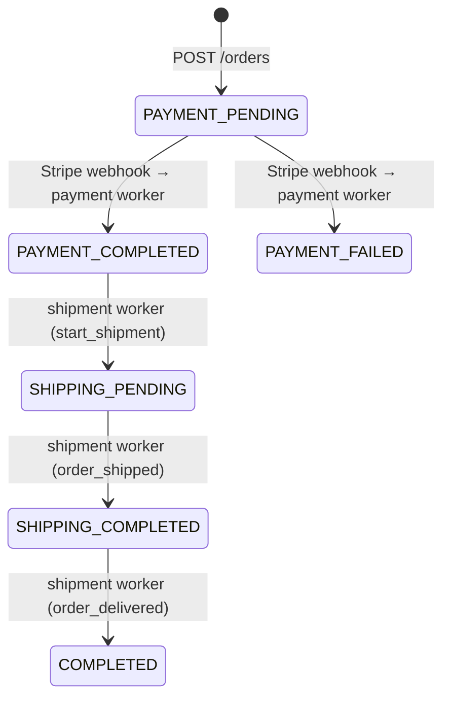
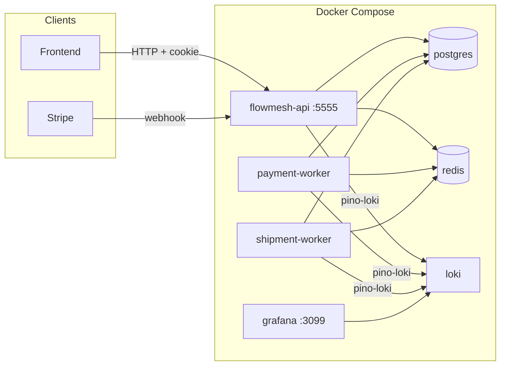

# flowMesh Backend

**flowMesh** is a TypeScript backend that models an **order → payment → shipment** workflow. It uses a Fastify API, PostgreSQL (Prisma), Stripe Checkout, and BullMQ + Redis for async background processing.

This repo is structured as a learning/demo project for event-driven order fulfillment.

---

## Features

### Authentication (`/auth`)

- **Register** — creates a user with bcrypt-hashed password and unique email; returns an HTTP-only JWT cookie (`flowmesh_token`, 24h expiry)
- **Login** — validates credentials and sets the same JWT cookie
- Protected routes read the token from cookies (not `Authorization: Bearer`)
- Secure cookie flag is controlled by `IS_PRODUCTION`

### Products (`/products`) — protected

- **GET /** — list all products
- **POST /** — create a product (`id`, `price`, `imageUrl`)

### Orders (`/orders`) — protected

- **GET /** — list orders for the authenticated user
- **POST /** — create an order with `products[]` (product IDs)
  - Validates products exist and calculates `totalAmount` from the product catalog
  - Uses a Prisma transaction to create `Orders` + `Payment` records
  - Creates a Stripe Checkout Session via the payment provider adapter and returns `paymentUrl`, `orderId`, `paymentId`, `sessionId`

### Payments (`/payments`)

- **POST /webhook** — Stripe webhook endpoint (no JWT; verified via Stripe signing secret)
  - Handles `checkout.session.completed`, `payment_intent.payment_failed`, `checkout.session.expired`
  - Enqueues payment jobs to BullMQ on success/failure (3 retries, exponential backoff)
- **GET /:orderId** — fetch payment records for given order IDs (query: `orderId`)

### Shipments (`/shipments`) — protected

- **GET /:orderId** — fetch shipment(s) for a given order

### Background Workers (BullMQ + Redis)

| Worker | Queue | Jobs |
|--------|-------|------|
| Payment worker | `paymentQueue` | `payment_completed`, `payment_failed` |
| Shipment worker | `shipmentQueue` | `start_shipment`, `order_shipped`, `order_delivered` |

**Payment worker** — on `payment_completed`:
- Updates `Payment` → `COMPLETED` and `Orders` → `PAYMENT_COMPLETED`
- Enqueues `start_shipment` on the shipment queue

**Shipment worker** — simulates fulfillment with delayed jobs:
- `start_shipment` → creates shipment (`PENDING`), order → `SHIPPING_PENDING`; schedules `order_shipped` after **60s**
- `order_shipped` → shipment → `SHIPPED`, order → `SHIPPING_COMPLETED`; schedules `order_delivered` after **120s**
- `order_delivered` → shipment → `DELIVERED`, order → `COMPLETED`

Jobs are persisted in Redis. Workers do not need to be running when a job is enqueued — they pick up waiting jobs when they start. Failed jobs retry up to 3 times with exponential backoff.

### Docker & Production Build

- **Docker Compose** spins up the full stack: PostgreSQL, Redis, API, both workers, and the logging stack (Loki, Promtail, Grafana)
- Separate **Dockerfiles** for the API (`src/api/DockerFile`) and workers (`src/workers/DockerFile`)
- Multi-stage build: `yarn build` compiles TypeScript to `dist/`; production images run compiled Node.js
- `.env.docker` overrides hostnames for in-network service discovery (`postgres`, `redis`, `loki`)
- API handles **graceful shutdown** on `SIGINT` / `SIGTERM`

### Observability

- Structured logging via **Pino** with per-module child loggers (`createLogger("context")`)
- Pretty console output in development (`pino-pretty`)
- **Grafana Loki** log shipping via `pino-loki` (enabled by default; set `ENABLE_LOKI=false` to disable)
- Optional **Docker logging stack**: Loki + Promtail + Grafana (see [Docker Compose](#docker-compose))

---

## Tech Stack

| Layer | Technology |
|-------|------------|
| Runtime | Node.js 22 + TypeScript |
| HTTP | Fastify 5 |
| Database | PostgreSQL + Prisma 7 (driver adapter) |
| Queue | BullMQ + Redis |
| Payments | Stripe Checkout |
| Auth | bcryptjs + jsonwebtoken + HTTP-only cookies |
| Logging | Pino, pino-pretty, pino-loki, Grafana Loki |
| Containers | Docker, Docker Compose |

---

## Order Lifecycle



### Important: redirect ≠ webhook

Completing Stripe Checkout redirects the browser to your frontend `success` page. That redirect alone does **not** update order status. Status changes happen when:

1. Stripe sends `checkout.session.completed` to `POST /payments/webhook`
2. The payment worker processes the queued job
3. The shipment worker processes the chained jobs

In local development you must forward Stripe webhooks with the Stripe CLI (see [INSTRUCTIONS.md](./INSTRUCTIONS.md)).

---

## API Endpoints

| Method | Path | Auth | Description |
|--------|------|------|-------------|
| POST | `/auth/register` | No | Register user (`username`, `password`, `email`) |
| POST | `/auth/login` | No | Login |
| GET | `/products` | Cookie | List products |
| POST | `/products` | Cookie | Create product |
| GET | `/orders` | Cookie | List user's orders |
| POST | `/orders` | Cookie | Create order + Stripe session |
| GET | `/payments/:orderId` | No* | Get payments by order ID |
| POST | `/payments/webhook` | Stripe signature | Stripe webhook |
| GET | `/shipments/:orderId` | Cookie | Get shipment for order |

\* Payment GET route is currently unauthenticated.

Default API port: **5555**

---

## Project Structure

```
flowMesh-backend/
├── lib/
│   ├── prismaClient.ts       # Prisma + pg adapter singleton
│   └── stripe.ts             # Stripe client
├── logger/
│   └── logger.ts             # Pino logger (pretty + Loki, child loggers)
├── prisma/
│   ├── schema.prisma         # DB models & enums
│   ├── migrations/           # Prisma migrations
│   └── seed.ts               # Product catalog seed
├── src/
│   ├── server.ts             # Fastify entry point
│   ├── api/
│   │   ├── DockerFile        # API container image
│   │   ├── routes/           # auth, orders, payments, shipments, products
│   │   ├── controllers/
│   │   ├── middlewares/      # JWT cookie auth
│   │   └── services/         # order, payment, Stripe/paymentProvider helpers
│   ├── queue/                # paymentQueue, shipmentQueue
│   ├── workers/
│   │   ├── DockerFile        # Worker container image
│   │   ├── paymentWorker.ts
│   │   └── shipmentWorker.ts
│   ├── schema/               # Fastify JSON Schema validation
│   └── generated/prisma/     # Prisma client output
├── docker-compose.yml        # Full local stack (DB, Redis, API, workers, logging)
├── .env.docker               # Docker Compose runtime overrides
├── loki-config.yaml          # Loki configuration
├── promtail-config.yaml      # Promtail configuration
├── INSTRUCTIONS.md           # Detailed dev & prod setup guide
└── package.json
```

---

## NPM Scripts

| Script | Purpose |
|--------|---------|
| `yarn dev` | Start API server in watch mode (`tsx`) |
| `yarn build` | Compile TypeScript to `dist/` |
| `yarn start` | Run compiled API (`node dist/src/server.js`) |
| `yarn worker:payment` | Start payment worker (requires `yarn build` first) |
| `yarn worker:shipment` | Start shipment worker (requires `yarn build` first) |
| `yarn db:seed` | Seed product catalog |

Database migrations:

```bash
npx prisma migrate dev    # development
npx prisma migrate deploy # production
npx prisma generate       # regenerate client after schema changes
```

---

## Environment Variables

See [INSTRUCTIONS.md](./INSTRUCTIONS.md) for the full list and setup. Required variables include:

| Variable | Purpose |
|----------|---------|
| `DATABASE_URL` | PostgreSQL connection string |
| `REDIS_HOST`, `REDIS_PORT` | Redis for BullMQ |
| `SECRET_JWT`, `COOKIE_SECRET` | Auth |
| `STRIPE_SECRET_KEY`, `STRIPE_WEBHOOK_SECRET` | Stripe |
| `FRONTEND_URL` | CORS + Stripe redirect URLs |
| `PORT` | API port (default `5555`) |
| `HOST` | Bind address (default `0.0.0.0` in Docker) |
| `IS_PRODUCTION` | Secure cookie flag (`true` in prod) |
| `ENABLE_LOKI` | Set to `false` to disable Loki transport |
| `LOKI_HOST` | Loki push URL (default `http://localhost:3100`) |
| `LOG_LEVEL` | Pino log level (default `info`) |

---

## Getting Started

Full step-by-step setup (PostgreSQL, Redis, Stripe CLI, workers, production deployment) is in **[INSTRUCTIONS.md](./INSTRUCTIONS.md)**.

### Option A — Local development (manual)

```bash
yarn install
npx prisma migrate dev
yarn db:seed
yarn build   # required before starting workers

# Terminal 1 — API (watch mode)
yarn dev

# Terminal 2 — Payment worker
yarn worker:payment

# Terminal 3 — Shipment worker
yarn worker:shipment

# Terminal 4 — Stripe webhook forwarding (required for payment status updates)
stripe listen --forward-to localhost:5555/payments/webhook
```

Start PostgreSQL and Redis separately (see [INSTRUCTIONS.md](./INSTRUCTIONS.md) for Docker one-liners).

### Option B — Docker Compose

Runs PostgreSQL, Redis, API, both workers, Loki, Promtail, and Grafana together.

**Prerequisites:** Docker and Docker Compose installed; a `.env` file with secrets (`SECRET_JWT`, `COOKIE_SECRET`, `STRIPE_*`, `FRONTEND_URL`, etc.). `.env.docker` is loaded automatically and overrides hostnames for in-network services.

```bash
# Build and start all services
docker compose up --build -d

# Run migrations (first time or after schema changes)
docker compose exec flowmesh-api npx prisma migrate deploy

# Seed product catalog (first time)
docker compose exec flowmesh-api yarn db:seed
```

| Service | URL / Port |
|---------|------------|
| API | `http://localhost:5555` |
| PostgreSQL | `localhost:5434` |
| Redis | `localhost:6379` |
| Loki | `http://localhost:3100` |
| Grafana | `http://localhost:3099` |

Stripe webhooks still need forwarding in development — run `stripe listen --forward-to localhost:5555/payments/webhook` on the host and set `STRIPE_WEBHOOK_SECRET` in `.env`, then restart the API container.

View logs:

```bash
docker compose logs -f flowmesh-api
docker compose logs -f flowmesh-payment-worker flowmesh-shipment-worker
```

---

## Data Model

| Model | Purpose |
|-------|---------|
| `Users` | Auth (`username`, `email`, `password`) |
| `Product` | Catalog (`id`, `price`, `imageUrl`) |
| `Orders` | Product list, total, status, linked to user |
| `Payment` | One-to-one with order, status enum |
| `Shipment` | One-to-one with order, products, status enum |

---

## Architecture (Docker Compose)



---

## License

ISC
